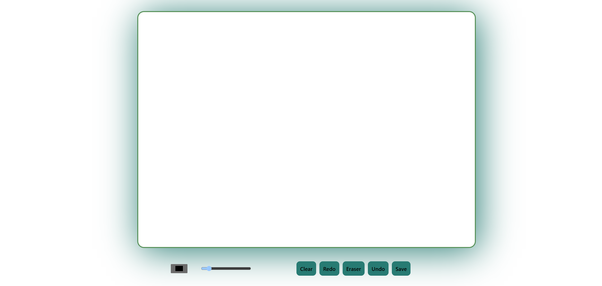

# Reactjs drawing_Board

A collaborative drawing board application with various features.

## Table of Contents

- [Description](#description)
- [Features](#features)
- [Technologies Used](#technologies-used)
- [Getting Started](#getting-started)
- [Usage](#usage)
- [Images](#images)
- [Future Enhancements](#future-enhancements)

## Description

The project is a web-based collaborative drawing board that allows users to draw, save their drawings, and collaborate with others in real-time. It provides various tools for drawing and editing, such as different colors, line widths, eraser, undo/redo functionality, and more.

## Features

- Drawing board with various drawing tools (colors, line widths, eraser, etc.).
- Real-time collaboration, allowing multiple users to draw together.
- Ability to save drawings as image files.
- User accounts for saving and managing drawings.
- Eraser functionality that can clean any color, not just replace colors.
- Ability to save files to avoid accidentally losing work.

## Technologies Used

- Reactjs, styled-components,hooks

## Getting Started

To run the project locally, follow these steps:

1. Clone the repository: `git clone repository URL`
2. Install dependencies: `npm install`
3. Start the development server: `npm run dev`
4. Open the application in your browser: `http://localhost:5173/`

## Images

images

## Future Enhancements

Add functionality for users to customize the board color and create/manage multiple boards within the application.